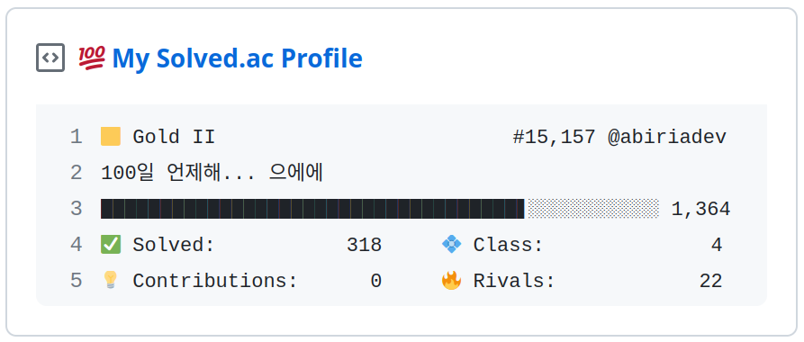

<h1 align="center">Solved.ac Box</h1>

 
 

  📊 <a href="https://solved.ac">Solved.ac</a>의 프로필 정보를 GitHub Gist로 보여주는 GitHub Action 📊

---

> [!TIP]
> You can find the English README [here](./README.en.md).

## 🎒 사전 준비

1. [새 GitHub PAT 토큰 생성 페이지](https://github.com/settings/personal-access-tokens/new)에서 `Gists`를 `Read and write`로 변경하고 생성 후 생성된 토큰 저장
2. [GitHub Gist](https://gist.github.com/)에서 새 Public Gist를 생성한 후 ID 저장
3. 마지막으로, 자신의 백준 ID 준비!

## 🖥 셋업 방법

1. [본 저장소를 포크](https://github.com/abiriadev/solvedac-box/fork)합니다.
2. `Settings` > `Secrets and variables` > `Actions` 로 들어가 `New repository secret`을 눌러 다음 정보를 시크릿으로 추가합니다.
3. `Actions` > `Update Gist` 로 들어가 `Run workflow` > `Run workflow` 버튼을 클릭!
4. Gist가 업데이트 된 후 자신의 GitHub 프로필에 핀하면 완료!

## 🤫 환경변수 설정

-   **GH_TOKEN:** 앞서 생성한 GitHub 토큰
-   **GIST_ID:** 앞서 생성한 Gist의 ID
-   **USERNAME:** 백준 ID

## 📄 라이선스

_Special thanks to [BOJ](https://www.acmicpc.net/) and [@solved-ac](https://github.com/solved-ac)_
